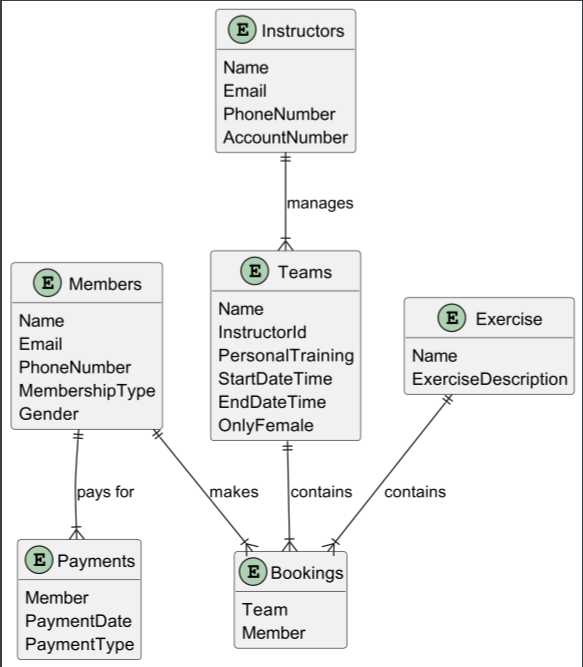
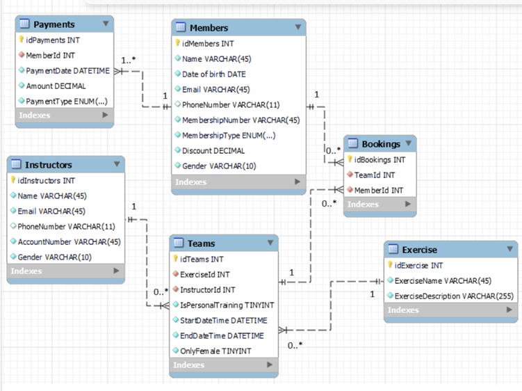

# OLA_2_DB

# table of contents

- [OLA\_2\_DB](#ola_2_db)
- [table of contents](#table-of-contents)
  - [1 ER Modellering](#1-er-modellering)
  - [2 Normalisering](#2-normalisering)
    - [1NF](#1nf)
    - [2NF](#2nf)
    - [3NF](#3nf)
    - [Detalje](#detalje)
    - [Normalisering af ER diagram](#normalisering-af-er-diagram)
      - [Eksempel brud på anden normalform](#eksempel-brud-på-anden-normalform)
      - [Eksempel brud på tredje normalform](#eksempel-brud-på-tredje-normalform)
  - [3 Mapping til Relationel model](#3-mapping-til-relationel-model)

## 1 ER Modellering
Vores ER diagram er lavet med UML, og er blevet lavet ud fra de krav der er blevet stillet i opgaven. Vi har bl.a. inkluderet en attribut - onlyfemale på teams, så det er muligt at lave træninger som kun er for kvinder. Vi har undervejs prøvet at forme ER diagrammet efter hvordan domænet ser ud i virkeligheden.

## 2 Normalisering

### 1NF
Første normalform er opfyldt, da alle attributter i tabellerne er atomare og der ikke er nogle gentagene grupper i tabellerne. 

### 2NF
Anden normalform er også opfyldt, da der ikke er nogle delvist afhængige ikke nøgle-attributer i vores tabeller.

### 3NF
Tredje normalform er opfyldt da der ikke er nogle transitive afhængigheder i tabellerne.

### Detalje
Excersise tabellen kan man argumentere for bryder med tredje normalform, da Excersisedescription evt. kunne være afhængig af Excersisename. Vi har dog besluttet at lade den forblive i tabellen frem for lave en seperat tabel, da det ville skabe et unødvendigt join ved utræk.

### Normalisering af ER diagram

####  Eksempel brud på anden normalform
Vores ER diagram er allerde normaliseret. Et eksemepl på hvordan den kunne bryde med anden normalform ville være hvis exercise og teams tabellerne var slået sammen. I så fald ville anden normalform brydes, da Excercisename ville afhængig af IdExcercise og derfor ikke afhænge af hele primærnøglen som er iDTeams.

####  Eksempel brud på tredje normalform
Et eksempel hvordan tredje normalform kunne blive brudt ville have været hvis tabellerne Instructors og Teams var slået sammen. I så fald ville Gender og Onlyfemale være afhængie af hinanden, hvilket ville bryde med tredje normalform.

## 3 Mapping til Relationel model
Herunder er dokumentation for hvordan vores ER diagram ville mappes til en relational model. Der inkluderet foreign og primary keys.

